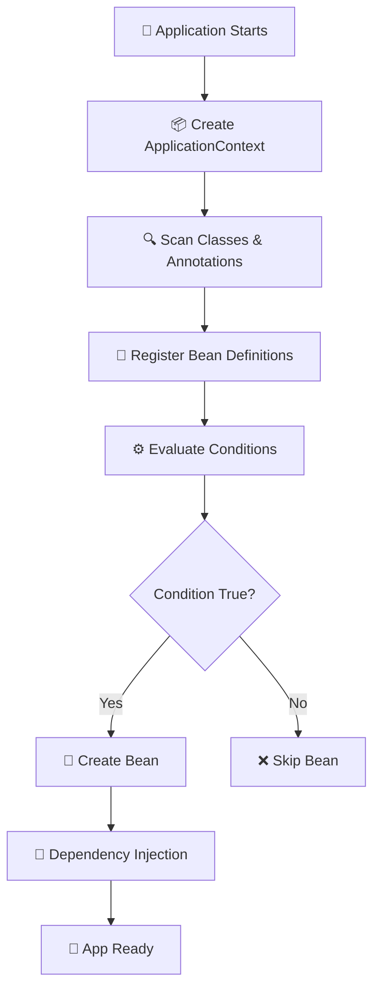
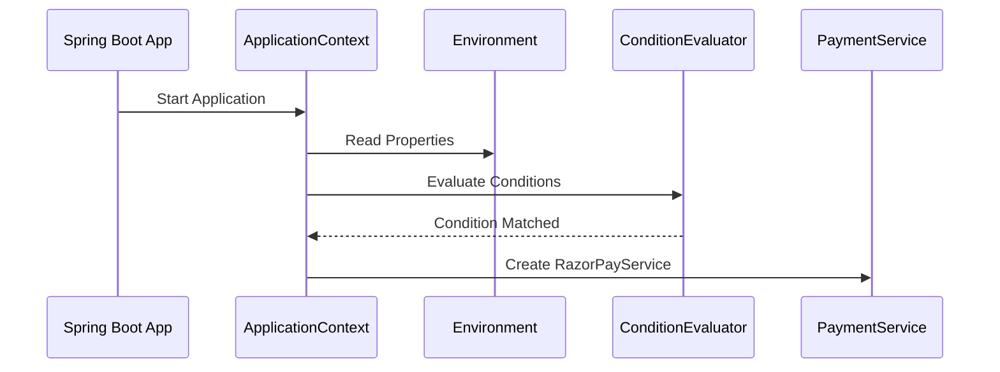

# 🌱 Internal Working of Spring Boot Beans (Interview + Beginner Friendly)

> 🚀 **This repository explains *how Spring Boot works internally* while creating beans, with a real-world payment example and interview-focused explanations.**

---

## 🎯 Who Is This For?

✅ Beginners learning Spring Boot internals
✅ Developers preparing for **Spring Boot interviews**
✅ Anyone confused about **how beans magically appear** ✨

---

## 📌 What You Will Learn

* 🧠 How Spring Boot **creates beans internally**
* ⚙️ How **`@ConditionalOnProperty` works behind the scenes**
* 🏗️ Difference between **BeanFactory vs ApplicationContext**
* 🔍 Internal classes like:

  * `ConditionEvaluator`
  * `AutoConfigurationImportSelector`
* 💳 How Spring chooses **RazorPay or Stripe** at runtime

---

## 🧩 Real-World Problem

In production systems, we often need:

* Multiple implementations (RazorPay, Stripe)
* Selection **based on configuration**, not code

❌ Using `if-else` or factory classes is messy

✅ Spring Boot solves this using **Conditional Beans**

---

## 🏗️ Conceptual Project Structure

```text
Application.java  (Entry Point)
│
├── PaymentService (Interface)
│   ├── RazorPayService        (@ConditionalOnProperty)
│   └── StripePaymentService  (@ConditionalOnProperty)
│
└── PaymentSuccessful (Consumes PaymentService)
```

---

## 🚀 What Happens When Application Starts?

```java
SpringApplication.run(Application.class, args);
```

### 🎤 Interview Answer (Short & Crisp)

> Spring Boot starts by creating an `ApplicationContext`, scans the classpath, registers bean definitions, evaluates conditions, creates eligible beans, injects dependencies, and finally starts the application.

---

## 🔄 Spring Boot Startup Flow (Beginner Friendly)



---

## 🧠 Bean Lifecycle (Simple Explanation)

### 1️⃣ Classpath Scanning 🔍

Spring scans for:

* `@Component`
* `@Service`
* `@Configuration`
* `@Bean`

👉 **Only metadata is collected**, not objects

---

### 2️⃣ Bean Definition Phase 📝

Spring creates **BeanDefinition objects** containing:

* Class name
* Scope
* Conditions
* Dependencies

⚠️ No object is created yet!

---

### 3️⃣ Condition Evaluation ⚙️

This is where `@ConditionalOnProperty` comes into play 👇

---

## 🔐 How `@ConditionalOnProperty` Works (Internally)

```java
@ConditionalOnProperty(
  name = "payment.provider",
  havingValue = "razorPay"
)
```

### 🧠 Internal Flow

1. 📖 Spring reads `application.properties`
2. 🧠 `ConditionEvaluator` is triggered
3. 🔍 Property value is fetched from `Environment`
4. ⚖️ Compared with `havingValue`
5. ✅ Match → BeanDefinition allowed
6. ❌ No match → BeanDefinition ignored

---

## 🧩 Internal Class: `ConditionEvaluator`

🎯 **Responsibility**:

> Decides whether a bean should be created or skipped

📍 Called during **configuration class parsing**

```text
ConfigurationClassPostProcessor
   └── ConditionEvaluator
        └── matches(...)
```

---

## 💳 Payment Provider Example

### 🔧 application.properties

```properties
payment.provider=razorPay
```

---

### 🟢 RazorPay Bean (Created)

```java
@Service
@ConditionalOnProperty(name = "payment.provider", havingValue = "razorPay")
public class RazorPayService implements PaymentService {}
```

✔️ Condition matched → Bean created

---

### 🔴 Stripe Bean (Skipped)

```java
@Service
@ConditionalOnProperty(name = "payment.provider", havingValue = "stripe")
public class StripePaymentService implements PaymentService {}
```

❌ Condition failed → Bean skipped

---

## 🔗 Dependency Injection (Important Interview Point)

```java
@Autowired
private PaymentService paymentService;
```

🧠 Spring injects **only one matching bean**

> ❓ What if multiple beans match?
> 👉 Spring throws `NoUniqueBeanDefinitionException`

---

## 🏗️ BeanFactory vs ApplicationContext

| Feature              | BeanFactory | ApplicationContext |
| -------------------- | ----------- | ------------------ |
| Bean creation        | Lazy        | Eager (default)    |
| AOP support          | ❌           | ✅                  |
| Events               | ❌           | ✅                  |
| Internationalization | ❌           | ✅                  |
| Used in Spring Boot? | ❌           | ✅                  |

🎤 **Interview Tip**:

> Spring Boot always uses `ApplicationContext` because it provides enterprise features.

---

## 🧠 Auto Configuration – Hidden Magic ✨

Spring Boot loads:

```text
spring.factories
   → AutoConfigurationImportSelector
```

### 🔍 Internal Class: `AutoConfigurationImportSelector`

🎯 **Responsibility**:

* Finds auto-config classes
* Applies `@Conditional` checks
* Imports matching configurations

---

## 🐞 Debugging Spring Boot Internals

Add this to see magic happen 👇

```properties
logging.level.org.springframework=DEBUG
```

🔎 You will see:

* Condition evaluation logs
* Auto-configuration reports
* Bean creation sequence

---

## 🎯 Final Execution Flow (Interview Friendly)



---

## 🌟 Key Interview Takeaways

✅ Beans are created **only after condition evaluation**
✅ Conditions are checked **before object instantiation**
✅ `@ConditionalOnProperty` enables **feature toggling**
✅ Spring Boot uses **ApplicationContext, not BeanFactory**

---

## 📚 Best Use Cases of Conditional Beans

* Payment gateways
* Feature flags
* Multi-tenant apps
* Environment-based configs

---

## 🙌 Contribution

⭐ Star the repo if it helped
🧠 Improve explanations
🔧 Add more Spring internals

Happy Learning & Interview Cracking! 🚀🔥
